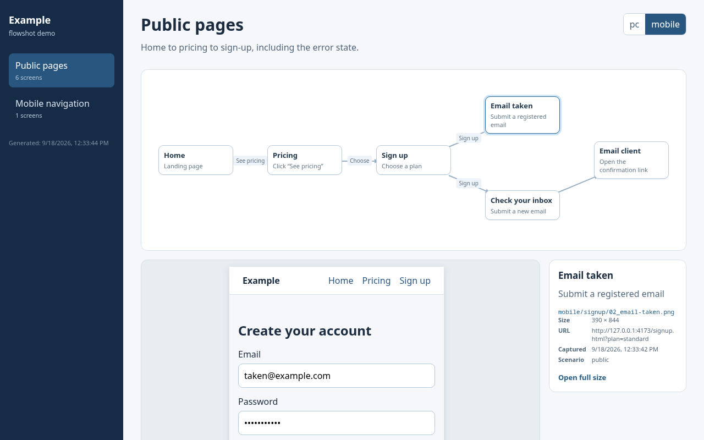
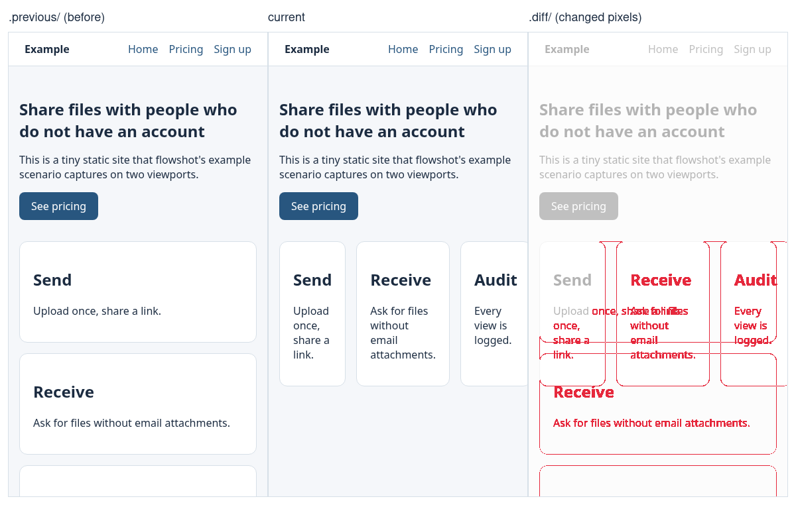

# flowshot

Scenario-driven screenshot capture and flow viewer for web apps — built so that
both people and LLM agents can verify UI changes at real viewport widths.



Break a mobile layout, run `flowshot run --only public --viewport mobile`, then
`flowshot diff`:

```
changed  mobile/public/01_home.png  6.56% changed (size 390x844 → 396x857)  region 0,0 396x857  → .diff/mobile/public/01_home.png
changed  mobile/public/02_pricing.png  6.22% changed  region 13,161 364x530  → .diff/mobile/public/02_pricing.png
```



Both images come from the bundled [`example/`](example/) site.

- **Scenarios** describe how to reach a screen (seed data, mock APIs, click
  through) and what to capture. One browser, one `setup` per scenario, one
  `capture` per viewport.
- **Flows** map captures onto transition diagrams so a reviewer can see *why*
  a screen appears, not just what it looks like.
- **`manifest.json`** indexes every capture (path, viewport, size, URL, time)
  so tools — including an LLM that cannot open the HTML viewer — can find,
  compare and inspect screens.
- **Viewer** is a single self-contained `index.html`: flow diagram, PC/mobile
  toggle, gallery, and missing-capture markers.

## Install

Written in TypeScript, ships with type declarations, zero runtime
dependencies (Playwright is a peer).

The package is `@keyhole-koro/flowshot` (the unscoped `flowshot` on npm is
an unrelated project); the CLI is still `npx flowshot`. Until it is
published, install from GitHub or as a git submodule — both put it at
`node_modules/@keyhole-koro/flowshot`, so
`import { defineScenario } from "@keyhole-koro/flowshot"` works either way.

### Requirements

- Node ≥ 20 to run; Node ≥ 22.18 (or 23.6+) to write config and scenarios
  in TypeScript, which Node then runs directly by stripping types
- Playwright ≥ 1.40 in your project (`npm i -D playwright`)
- A running instance of the app you want to capture; flowshot does not
  start it

### Option A — from GitHub

```bash
npm install --save-dev github:Keyhole-Koro/flowshot playwright
npx playwright install chromium
```

npm runs the package's `prepare` script on install, which compiles
`src/` to `dist/`. Pin a commit with `github:Keyhole-Koro/flowshot#<sha>`.
Once published: `npm install --save-dev @keyhole-koro/flowshot playwright`.

### Option B — git submodule (when you want to hack on flowshot too)

```bash
git submodule add git@github.com:Keyhole-Koro/flowshot.git tools/flowshot
npm install --save-dev file:tools/flowshot playwright
npx playwright install chromium
```

`node_modules/flowshot` becomes a symlink to `tools/flowshot`, and
`npm install` builds `dist/` there. After pulling flowshot changes run
`npm --prefix tools/flowshot run build`. Fresh clones need
`git submodule update --init tools/flowshot` before `npm install`. Builds
that skip the submodule (Docker images that only copy `package*.json`)
still pass `npm ci`; the link just dangles.

## Set up a project

1. **Scaffold.** From the project root:

   ```bash
   npx flowshot init
   ```

   This writes `flowshot.config.ts` and `flowshot/scenarios/public.ts`
   (`.mjs` on Node < 22.18; `--force` to overwrite) and copies the Claude Code
   skills into `.claude/skills/`. In a project whose `package.json` has no
   `"type": "module"`, rename the two files to `.mts` so Node treats them as
   ES modules without a warning; flowshot discovers `flowshot.config.mts` too.

2. **Point it at your app.** Edit the config: `baseUrl`, the viewports you
   care about, `warmUp` routes if your dev server compiles on demand (Vite),
   and a `beforeShoot` hook if pages render data client-side after load:

   ```ts
   beforeShoot: async (page) => {
     await page.waitForFunction(() => document.body.innerText.trim().length > 80).catch(() => {});
   },
   ```

3. **Write scenarios** under `flowshot/scenarios/` — one file per user path
   (see [Quick start](#quick-start) and [Scenario API](#scenario-api)).
   Seed state in `setup()` (write to your DB or call your API), inject a
   session cookie with `newPage({ cookies })`, mock hard-to-reach states with
   `page.route()`. Keep project helpers in `flowshot/lib/`.

4. **Capture.** Start the app, then:

   ```bash
   npx flowshot run           # everything
   npx flowshot lint          # every flow node captured, nothing orphaned
   ```

   Open `output/captures/index.html`. Add `output/captures/` to
   `.gitignore`.

5. **Wire it in.** Suggested `package.json` scripts:

   ```json
   "capture": "flowshot run",
   "capture:viewer": "flowshot viewer",
   "capture:lint": "flowshot lint"
   ```

   For TypeScript projects, include the files in your `tsconfig.json` so
   `tsc --noEmit` checks them: `"include": ["flowshot/**/*.mts", "flowshot.config.mts"]`
   plus `"allowImportingTsExtensions": true` if scenarios import each other
   with `.mts` extensions.

6. **CI (optional).** Capture on every PR and publish the viewer as an
   artifact:

   ```yaml
   - run: npx playwright install --with-deps chromium
   - run: npm run dev &            # or however the app starts
   - run: npx wait-on http://localhost:3000
   - run: npx flowshot run --json > flowshot-summary.json
   - uses: actions/upload-artifact@v4
     with: { name: captures, path: output/captures }
   ```

   `run` exits 1 when a scenario fails; `lint` exits 1 when a flow node has
   no capture.

7. **Let the agent use it.** The skills copied in step 1 teach Claude Code
   to re-capture, diff and read only the screens it touched — see
   [Working with an LLM agent](#working-with-an-llm-agent). Put
   project-specific facts (how to launch the app, seed helpers, test ids) in
   your own skill or README and point at them.

## Quick start

`flowshot.config.ts` in your project root:

```ts
import { defineConfig } from "@keyhole-koro/flowshot";

export default defineConfig({
  baseUrl: "http://localhost:3000",
  outDir: "output/captures",
  scenarios: ["captures/scenarios/*.ts"],
  viewports: [
    { name: "pc", width: 1440, height: 1000 },
    { name: "mobile", width: 390, height: 844, isMobile: true, hasTouch: true },
  ],
});
```

`captures/scenarios/public.ts`:

```ts
import { defineScenario } from "@keyhole-koro/flowshot";

export default defineScenario({
  id: "public",
  title: "Public pages",
  async capture({ newPage, goto, shoot }) {
    const page = await newPage();
    await goto(page, "/");
    await shoot(page, "public/01_home.png");
    await goto(page, "/pricing");
    await shoot(page, "public/02_pricing.png");
  },
  flows: [
    {
      id: "public",
      title: "Public pages",
      nodes: [
        { id: "home", title: "Home", condition: "Landing", image: "public/01_home.png", x: 25, y: 50 },
        { id: "pricing", title: "Pricing", condition: "Click “Pricing”", image: "public/02_pricing.png", x: 70, y: 50 },
      ],
      edges: [["home", "pricing", "Pricing"]],
    },
  ],
});
```

Or let flowshot generate the flow from a list of steps:

```ts
export default defineScenario({
  id: "public",
  title: "Public pages",
  steps: [
    { id: "home", title: "Home", condition: "Landing", goto: "/", image: "public/01_home.png" },
    { id: "pricing", title: "Pricing", via: "Pricing",
      act: async (page) => { await page.getByRole("link", { name: "Pricing" }).click(); await page.waitForURL(/pricing/); },
      image: "public/02_pricing.png" },
  ],
});
```

Then, with your app running:

```bash
npx flowshot run            # captures every scenario × viewport, writes manifest.json + index.html
npx flowshot run --only public --viewport mobile
npx flowshot list --json    # scenarios, viewports and captures as JSON
npx flowshot lint           # flow nodes without captures, captures without flows, last-run failures
npx flowshot diff           # what changed since the previous run (pixel diff + highlight images)
npx flowshot inspect public/01_home --viewport mobile --tile 1200   # split a tall capture for reading
npx flowshot viewer         # rebuild index.html from manifest.json only
npx flowshot init           # starter config + copy the bundled agent skills into .claude/skills/
```

Open `output/captures/index.html` in a browser. `npx flowshot help` lists every option.

A runnable example lives in [`example/`](example/): `npm run example` serves
a static site on :4173, `npm run example:capture` captures it.

## Scenario API

```js
defineScenario({
  id,               // [a-z0-9-], unique; used by --only and the manifest
  title, description,
  order,            // sort key for run and viewer order (default 0, then file path)
  viewports,        // optional subset of config viewport names
  async setup({ config, baseUrl, log }) {},        // once per scenario → state
  async capture(ctx) {},                           // once per viewport (or use `steps`)
  async teardown({ config, baseUrl, state, log }) {},
  flows: [ { id, title, description, viewports?, diagramHeight?, nodes, edges } ],

  // Declarative alternative to capture(): one shared page, one node per step.
  page,             // options for that page, or ({ state }) => options (e.g. cookies)
  async prepare(page, ctx) {},                     // route mocks etc. before the first step
  steps: [ { id, title, condition, goto, act, waitFor, image, from, via, viewports, note, x, y } ],
  flow,             // overrides for the generated flow (title, description, diagramHeight, viewports)
});
```

Steps run in order on the shared page: `goto` (path or `(state) => path`),
then `act(page, ctx)`, then `waitFor` (a test id, or `(page, ctx) => …`), then
`shoot(image)` if `image` is set. Edges default to “previous step → this
step”; `from` (`"id"`, `["a", "b"]`, or `null`) and `via` (label) override.
Positions come from a layered layout unless a step sets `x`/`y` (%).

`capture(ctx)` receives:

| helper | what it does |
| --- | --- |
| `ctx.newContext({ cookies, ...playwrightOptions })` | Browser context sized for the current viewport. `cookies: [{ name, value }]` are added for `baseUrl`. Contexts are closed for you. |
| `ctx.newPage(options)` | `newContext` + `newPage`. |
| `ctx.goto(page, "/path", options)` | `page.goto(baseUrl + path)`, `waitUntil: "networkidle"` by default. |
| `ctx.shoot(page, "dir/01_name.png", { fullPage = true })` | Saves `<outDir>/<viewport>/dir/01_name.png` and records it in the manifest. Waits for fonts and `settleMs` first. |
| `ctx.viewport`, `ctx.state`, `ctx.baseUrl`, `ctx.config`, `ctx.log`, `ctx.browser` | Plain data. |

Flow nodes reference images by the path passed to `shoot` (without the
viewport prefix); the viewer resolves the viewport at display time. A node
without `image` is a transition target (e.g. “redirect back”); give it a
`note` to explain.

## Config

| key | default | notes |
| --- | --- | --- |
| `baseUrl` | `http://localhost:3000` | env `BASE_URL` overrides |
| `outDir` | `output/captures` | env `OUT_DIR` overrides; relative to the config file |
| `scenarios` | `flowshot/scenarios/*.{mjs,ts,mts}` | globs (`*`, `**`) or file paths |
| `viewports` | pc 1440×1000, mobile 390×844 | `{ name, width, height, isMobile?, hasTouch? }` |
| `settleMs` | `600` | quiet time before each screenshot |
| `beforeShoot` | `null` | `async (page, { viewport, scenario, path })` hook, e.g. wait for client-side data |
| `warmUp` | `[]` | routes to visit once before capturing (on-demand dev servers) |
| `launch` | `{ args: ["--no-sandbox"] }` | `chromium.launch()` options; env `CHROMIUM_EXECUTABLE_PATH` sets `executablePath` |
| `viewer.title`, `viewer.subtitle`, `viewer.lang` | `flowshot` / … / `en` | |
| `viewer.viewportLabels` | viewport names | `{ pc: "PC", mobile: "Mobile" }` |
| `viewer.labels` | English | every UI string in the viewer, for localisation |

## Output

```
output/captures/
  manifest.json          # { version, generatedAt, baseUrl, viewports, scenarios, failures, captures[] }
  index.html             # the viewer
  pc/<dir>/<name>.png
  mobile/<dir>/<name>.png
  .previous/             # the versions overwritten by the last run (for `diff`)
  .diff/                 # highlight images written by `diff`
  .inspect/              # crops and tiles written by `inspect`
```

`run --only <id> [--viewport v]` replaces only the matching entries in the
manifest, so partial re-captures keep the index whole. Failures do not abort
the run by default (`--fail-fast` to change); they are listed at the end, in
the manifest, and the exit code is 1.

### diff

`flowshot diff [--against <dir>] [--only <id,...>] [--viewport <v,...>] [--threshold 0.0005] [--json]`

Compares each capture with `.previous/` (or any directory with the same
layout, e.g. captures from another branch). A pixel counts as changed when
any channel differs by more than 16; a capture counts as changed above the
threshold ratio or when its size changed. For each changed capture you get
the ratio, the bounding region of the change, and a highlight image under
`.diff/` (red over a faded copy of the current capture). No dependencies: the
PNG codec is built in.

### inspect

`flowshot inspect <capture> [--viewport <v>] [--crop x,y,w,h | --tile <height>] [--json]`

Writes crops or overlapping tiles of a capture under `.inspect/` so an agent
that reads images can look at a 390×8000 page piece by piece. `<capture>` is
an id (`app/billing/01_overview`), a viewport path, or a `.diff/…` path.

## Working with an LLM agent

The CLI is designed to be driven by an agent verifying its own UI changes:

1. `flowshot list --json` → find the capture for the screen you touched.
2. `flowshot run --only <scenario> --viewport mobile --no-viewer` → re-capture just that.
3. `flowshot diff --only <scenario>` → changed regions; `flowshot inspect … --crop` to read them.
4. `flowshot lint --json` → nothing missing, nothing orphaned.

`npx flowshot init` copies three Claude Code skills into `.claude/skills/`:

| skill | when it triggers |
| --- | --- |
| `flowshot-verify` | after a UI change: re-capture, diff, read, report |
| `flowshot-scenario` | a screen or path was added: write/extend a scenario and its flow |
| `flowshot-triage` | a run failed or a capture shows the wrong screen |

They are generic; keep project specifics (how to launch the app, seed
helpers, test ids) in your own skill or README and point at these.

## Releasing

`npm version <patch|minor|major>` bumps `package.json` and creates a `vX.Y.Z`
tag; `git push --follow-tags` triggers [`publish.yml`](.github/workflows/publish.yml),
which runs the tests and publishes with provenance. Auth is either npm
trusted publishing (configure this repository and workflow on the package's
npm settings) or an `NPM_TOKEN` repository secret (granular token with
2FA bypass).

## Development

```bash
npm ci && npx playwright install chromium
npm run build       # tsc → dist/ (Node code), dist/viewer/client.js (browser), assets
npm test            # builds, then node --test: end-to-end against example/ plus unit checks
npm run example     # serve example/ on :4173; then npm run example:capture
```

Everything is TypeScript. `src/` is compiled to `dist/` (Node, ESM,
`NodeNext`); `src/viewer/client.ts` is compiled separately into the browser
script inlined in `index.html`; `example/` and `test/` run uncompiled on
Node's type stripping (so developing flowshot needs Node ≥ 22.18, using it
does not). `skills/` holds the Claude Code skills copied by `flowshot init`,
`docs/` the README images regenerated from the example.

## Roadmap

- `diff --against git:<ref>` — compare with captures committed or stashed on another ref
- Ignore regions / masks for known-dynamic areas
- Per-flow HTML export for sharing a single diagram

## License

MIT
